# BidNaija Beta-Readiness End-to-End Design

**Date:** 2026-09-17
**Status:** Approved for planning
**Scope:** Local application code with the configured sandbox services and database

## Purpose

Prove that BidNaija is ready for external beta testers by exercising the real browser UI across authentication, account roles, listing access, mechanic verification, sandbox funding, car and gadget listings, bidding, auction settlement, delivery, notifications, support, and disputes. Any defect found in the flow must be reproduced, fixed, and covered by an automated regression test before the test run continues.

The test is UI-first. Database or backend access is limited to:

- reading email verification codes or marking test accounts verified;
- promoting the dedicated QA account to admin;
- marking test identities KYC-verified where the external provider cannot be used safely;
- inspecting authoritative records after a UI action when the UI cannot prove the financial invariant;
- checking and applying repository migrations.

All ordinary product actions—signup, login, listing-access requests, access-code redemption, mechanic review, funding simulation, listing creation, listing submission, approval, bidding, force-close, payment confirmation, settlement, delivery, notifications, support, and disputes—must happen through the UI.

## Baseline Evidence

At design time:

- all 24 TypeORM migrations are applied to the configured database;
- all 49 backend suites pass, covering 229 tests;
- frontend and backend TypeScript checks pass;
- frontend and backend lint checks pass;
- frontend and backend development servers are stopped and must be started for execution;
- the worktree contains pre-existing, uncommitted authentication and UI fixes that must be preserved.

## Test Strategy

Use Playwright as the repeatable browser driver and retain traces, screenshots, videos on failure, request failures, console errors, and step-level evidence. Supplement the automated run with targeted visual inspection at desktop and mobile widths. Use stable labels and roles rather than CSS selectors wherever possible.

Each defect follows a red-green-regression cycle:

1. capture the failing UI action and the backend response;
2. add the smallest regression test that proves the defect;
3. implement the fix without overwriting unrelated worktree changes;
4. rerun the focused test;
5. rerun the affected suite;
6. continue the end-to-end scenario from a known valid state.

## Account Matrix

Every run uses timestamped QA identities so it does not depend on pre-existing users.

| Identity | Registration role | Product responsibility |
|---|---|---|
| QA Admin | Individual bidder, promoted after signup | Admin operations and approvals |
| QA Mechanic | Mechanic | Mechanic verification and car inspection assignment |
| QA Car Dealer | Car dealer | Requests car access and lists a car |
| QA Gadget Seller | Individual bidder | Requests gadget access and lists a gadget |
| QA Bidder A | Individual bidder | Lower balance, limit rejection, first valid bids |
| QA Bidder B | Individual bidder | Higher balance, outbids, wins the car auction |
| QA Code User | Individual bidder | Redeems an admin-issued listing access code |

The application has no dedicated gadget-dealer role. Gadget-selling capability is represented by an individual bidder with a `GADGET` listing permission.

## Referral Scope

Referral is attribution-only for this pass. The signup form accepts an optional string and Better Auth persists it as `auth_users.referral_code`. The test must:

- create one account without a referral value;
- create one account with a unique QA referral marker;
- complete signup and verification through the same UI flow;
- verify the marker is persisted exactly once on the referred account;
- verify the marker does not change role, wallet balance, listing permissions, or authentication.

There is no referral owner, validation, reward, or redemption domain model in the current product. The final report must label those behaviors as not implemented rather than imply they were tested.

## Identity and Verification Flow

1. Register every identity using the multistep signup form.
2. Exercise field validation, duplicate email, duplicate phone, password visibility, back/next navigation, and role selection.
3. Complete email verification using the backend-generated OTP or the approved database verification fallback.
4. Log in with email for every role and phone for at least one account.
5. Promote QA Admin using the repository admin-promotion workflow, log out, and log back in to prove effective admin authorization.
6. Mark bidding identities KYC-verified using the approved backend/database exception.
7. Verify the mechanic from the admin Mechanics screen and confirm the mechanic appears in the car listing selector.

Authentication failures must show the backend message when present. Expected examples include duplicate identity messages and invalid credential messages; a generic “failed” message is acceptable only when no structured backend message exists.

## Listing Access and Access Codes

1. QA Car Dealer submits a `CAR` listing-access application through the user UI.
2. QA Gadget Seller submits a `GADGET` application through the user UI.
3. QA Admin reviews and approves both applications through Listing approvals.
4. QA Admin creates a separate access code through Access codes.
5. QA Code User redeems the code through the user UI.
6. Verify permissions appear in profiles and category choices.
7. Exercise invalid, duplicate, expired/deactivated where practical, and already-granted code errors; each must surface the backend message.

## Real Listing Media

Use two high-resolution, reuse-permitted photos downloaded from reputable public sources: one real car and one real gadget. Record the source URL and license in the test report. Upload the files through the listing UI; do not inject URLs into the database. Use a harmless QA proof image or document for the gadget ownership field and label the listing titles with `QA` so they cannot be confused with real inventory.

The media checks cover:

- supported photo upload;
- preview and removal;
- at least one invalid file or limit rejection;
- persisted media on listing detail and auction detail;
- descriptive listing data rather than placeholder text.

## Listing Lifecycle

### Car

1. QA Car Dealer creates a car draft with a verified mechanic, real photo, base price, 10% hold, minimum increment, near-future start time, and finite duration.
2. Validate every creation step, back navigation, preview, and draft persistence.
3. Submit the listing through My listings.
4. QA Admin reviews and approves it, producing an auction.
5. Verify the listing and auction move through draft, pending, approved/scheduled, and live states.

### Gadget

1. QA Gadget Seller creates a gadget draft with real photo, proof document, specifications, condition, 10% hold, minimum increment, near-future start time, and finite duration.
2. Submit and approve through the same UI-led lifecycle.
3. Place valid competing bids.
4. Leave the gadget auction live at the end of the test, proving open-auction state and realtime display.

## Wallet and Bid Qualification

Fund bidders only through the Top up screen’s sandbox Simulate payment control.

Before approving the first listing, QA Admin sets the platform bid requirement to 10% through Settings. Listing approval must copy the greater of the seller-selected hold percentage and the admin minimum into the auction, proving that a seller cannot weaken the platform requirement.

Use balances and bid values that prove the configured hold percentage:

- with a 10% hold and a ₦50,000 wallet, the maximum qualifying bid is ₦500,000;
- a ₦500,001 bid must be rejected with the backend qualification message;
- a ₦500,000 bid may qualify if the full ₦50,000 remains available;
- with a ₦100,000 wallet, the maximum qualifying bid is ₦1,000,000;
- existing active holds reduce available funds even when the total balance remains unchanged;
- outbidding releases the previous leader’s hold;
- users cannot bid on their own auction;
- bids below base price or minimum increment are rejected;
- withdrawals cannot consume held funds.

The authoritative financial assertions are:

```text
required_hold = ceil(bid_amount * hold_percent / 100)
required_hold <= wallet.balance
required_hold <= wallet.balance - wallet.held
```

The UI must communicate the required hold and show the backend reason for rejection. Database inspection may confirm wallet, hold, bid, and ledger records after the corresponding UI action.

## Car Auction Completion

1. QA Bidder A places the first valid bid.
2. QA Bidder B places a valid higher bid.
3. Verify Bidder A is marked outbid, their hold is released, and they receive an outbid notification.
4. Verify realtime top-bid and bid-history updates.
5. QA Admin uses the auction monitor to force-close the auction.
6. Verify Bidder B is selected as winner and receives an auction-won notification.
7. Bidder B views payment instructions and confirms payment through the UI.
8. QA Admin settles the exact balance after the applied hold.
9. Verify the winning hold is applied, financial totals balance, and a delivery record is created.
10. QA Car Dealer progresses delivery through the seller-allowed states.
11. QA Bidder B confirms receipt.
12. Verify the final delivery state and both parties’ notifications.

## Complaints, Support, and Notifications

After settlement:

- the winner opens a dispute/complaint through the product UI;
- duplicate dispute creation is rejected with the backend message;
- the admin views and updates the dispute through the admin UI;
- a user opens support chat, sends a test message, and requests human assistance;
- the admin sees the waiting conversation, claims/responds through the support UI, and the user receives the response;
- failed sends retain or restore the user’s draft;
- notification unread counts, list state, mark-read, mark-all-read, and relevant deep links are exercised;
- notification records are checked for listing approval, wallet funding, outbid, win, payment, settlement, delivery, and support events where implemented.

External AI, email, WhatsApp, or push delivery is not required when credentials are absent. In-app notification and chat behavior remains required.

## Screen and Interaction Coverage

The run must visit and health-check:

- public: landing, login, register, OTP, forgot/reset password states;
- user: Home, Browse auctions, My bids, Won auctions, Deliveries, Wallet, Top up, Withdrawals, My listings, Create listing, listing detail/edit, Listing access, Redeem code, Notifications, Watchlist, Support, Profile/settings, auction detail, payment, and delivery;
- admin: Dashboard, Live auctions, Access codes, Listing approvals, Disputes, Users/wallets, Mechanics, Payments/ledger, Withdrawals, Settlements, Notifications, Support, System health, and Settings.

For each screen, verify no uncaught page error, failed application bootstrap, broken primary navigation, inaccessible modal dismissal, or unexpected horizontal overflow at desktop and mobile widths. Interactive inventory must cover visible primary buttons, forms, filters, pagination, toggles, and destructive confirmation dialogs relevant to the created QA data.

## Error Handling Contract

The frontend API client is the common boundary for structured backend failures. It must support string and array validation messages. Mutation screens must show `ApiError.message` when available and use a generic fallback only for network, parsing, or unexpected client failures.

The test records status code, backend error body, displayed message, route, and action for every intentional negative scenario. Sensitive credentials and cookies must not appear in artifacts.

## Performance and Code Quality

Record browser navigation and API response timing for the main flow. Flag:

- application routes exceeding 3 seconds locally after warmup;
- ordinary JSON APIs exceeding 1 second locally without external-provider work;
- duplicate requests or duplicated component mounts;
- repeated websocket subscriptions;
- console errors, hydration failures, and unhandled promise rejections;
- large unoptimized images or layout shifts;
- duplicated error-handling or flow logic encountered while fixing defects.

Optimization is evidence-driven. Do not perform unrelated refactors or claim production load capacity from a local single-user run.

## Execution Flow

```mermaid
flowchart TD
    A[Start services and verify health] --> B[Run migrations and baseline suites]
    B --> C[Create timestamped QA accounts in UI]
    C --> D[Verify accounts and promote QA Admin]
    D --> E[Verify mechanic in admin UI]
    E --> F[Request and approve car and gadget access]
    F --> G[Issue and redeem separate access code]
    G --> H[Fund bidders with UI simulation]
    H --> I[Create and approve car listing with real media]
    I --> J[Exercise invalid and valid car bids]
    J --> K[Outbid, verify holds and notifications]
    K --> L[Admin force-closes and selects winner]
    L --> M[Winner confirms payment]
    M --> N[Admin settles exact balance]
    N --> O[Seller ships and winner confirms receipt]
    O --> P[Raise dispute and exercise support handoff]
    P --> Q[Create and approve gadget listing with real media]
    Q --> R[Place competing gadget bids]
    R --> S[Leave gadget auction live]
    S --> T[Visit remaining screens and interactions]
    T --> U[Run regression, performance and completion audit]
    U --> V[Publish evidence-backed beta status report]
```



## Deliverables

Execution is complete only when the repository contains or the final report links to:

- repeatable Playwright coverage for the integrated QA scenario;
- focused regression tests for every defect fixed;
- test fixtures or documented source files for the real listing media;
- the exact timestamped QA identities and their final roles, excluding passwords;
- database evidence for applied migrations and financial invariants;
- a route/interaction coverage matrix;
- a defect log with fixed, unresolved, and external-service items separated;
- timing observations and targeted optimization results;
- a detailed end-to-end flow diagram;
- a final beta-readiness status of ready, conditionally ready, or not ready with reasons.

## Completion Rules

Passing unit tests alone is insufficient. Completion requires the browser-driven car lifecycle to settle and finish delivery, the gadget auction to remain live with valid bids, the referral attribution check to pass, support and complaint flows to produce records, notifications to be observed, every named screen to be visited, and every discovered in-scope defect either fixed and verified or explicitly identified as a beta-blocking unresolved issue.
