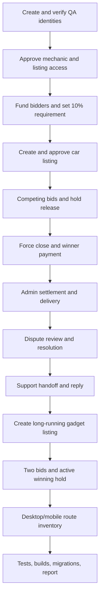

# BidNaija Beta-Readiness Report

**Run:** `20260917a` (continued through 18 September 2026)  
**Environment:** local frontend `http://localhost:3000`, local backend `http://localhost:4000`, configured sandbox database/storage  
**Classification:** **Conditionally ready for external beta**

BidNaija's local product paths are healthy and the tested browser journeys are repeatable. External beta should begin only after the provider-backed NIN/BVN sandbox test is run with deployment credentials and the normal staging secret/integration checklist is confirmed. No local application blocker remains in the covered flows.

## Outcome Summary

- 52 backend suites passed with 239 tests.
- 29 of 30 browser tests passed in the final serial matrix; the only skip was the deliberately credential-gated external KYC-provider sandbox test.
- Support coverage includes both human handoff and failed-send draft restoration.
- Frontend and backend type checks, lint checks, and production builds passed.
- All TypeORM migrations are applied; no migration is pending.
- 43 routes were checked at desktop and 43 at mobile, with no browser errors or horizontal overflow after fixes.
- Warm route inventory recorded a maximum of 1,287 ms on desktop and 699 ms on mobile, below the 3-second local threshold.
- The completed car auction is settled and delivered, with its dispute resolved.
- The replacement gadget auction remains live with two bids and the correct winning hold.

## QA Accounts

Passwords are intentionally omitted.

| Identity | Email | Effective responsibility |
|---|---|---|
| QA Admin | `beta.admin.20260917a@bidnaija.local` | Administrator |
| QA Mechanic | `beta.mechanic.20260917a@bidnaija.local` | Verified mechanic |
| QA Car Dealer | `beta.car.20260917a@bidnaija.local` | Car listing permission |
| QA Gadget Seller | `beta.gadget.20260917a@bidnaija.local` | Gadget listing permission |
| QA Bidder A | `beta.biddera.20260917a@bidnaija.local` | Competing bidder |
| QA Bidder B | `beta.bidderb.20260917a@bidnaija.local` | Winning bidder |
| QA Code User | `beta.code.20260917a@bidnaija.local` | Access-code redemption |

Email and KYC state were prepared through the approved exact-email test-account utility. Admin promotion used the repository's admin workflow. Referral attribution was persisted for the designated code user without adding role, wallet, or permission side effects.

## Auction Evidence

### Completed car

- Auction: `218fdd9e-ecea-4775-8468-7d1979ac8766`
- Listing: `2020 QA-20260917a Corolla`
- Final auction state: `SETTLED`
- Hold requirement: 10%
- Winning bid: ₦550,000
- Applied winning hold: ₦55,000
- External payment: ₦495,000
- Wallet payment: ₦0
- Delivery: `DELIVERED`
- Dispute: `RESOLVED`
- Resolution: “QA review completed; delivery evidence recorded and both parties notified.”

The UI covered below-base, below-increment, above-wallet-qualification, valid bid, outbid, seller self-bid prevention, force close, payment confirmation, exact settlement, delivery progression, receipt confirmation, dispute creation, admin investigation, and admin resolution. A backend regression confirms a second dispute for the same auction is rejected.

### Live gadget

- Auction: `137fd58d-1da9-414e-ae31-0e145fff0366`
- Listing: `QA-20260918a Apple iPhone 14 Pro`
- Final state: `LIVE`
- End time: 20 September 2026 at 01:38 UTC
- Hold requirement: 10%
- Bidder A: ₦350,000, `OUTBID`, ₦35,000 hold `RELEASED`
- Bidder B: ₦380,000, `WINNING`, ₦38,000 hold `ACTIVE`

The original 120-minute gadget auction expired naturally while the multi-hour verification continued and moved to `AWAITING_PAYMENT`. The admin UI correctly refused an early default because its payment deadline had not passed. It was not altered through the database. A replacement 48-hour auction was created, approved, bid on, and left live through the UI.

## Route and Interaction Matrix

| Area | Coverage | Result |
|---|---|---|
| Public | Landing, login, register, forgot, reset, OTP, verified | Pass at desktop and mobile |
| User core | Home, browse, bids, won, deliveries, wallet, top-up, withdrawals | Pass at desktop and mobile |
| User selling | Listings, create, detail, edit, access application, code redemption | Pass at desktop and mobile |
| User account | Notifications, watchlist, support, profile, KYC shell | Pass at desktop and mobile |
| Auction dynamic | Detail, payment, delivery | Pass at desktop and mobile |
| Admin | Dashboard, auctions, access codes, approvals, disputes, users, mechanics, payments, withdrawals, settlements, notifications, support, health, settings | Pass at desktop and mobile |

Primary forms, filters, toggles, pagination surfaces, modal dismissal, deep links, and destructive confirmation paths relevant to the QA records were exercised. Notification history included funding, winning, payment, delivery, dispute, and support events; single-item navigation and mark-all-read worked.

## Communication Evidence

- User support message persisted.
- “Talk to a human” is now an explicit user action using theme tokens.
- Admin claimed the waiting conversation and replied.
- User received the reply and an in-app notification.
- A forced 503 send regression confirmed the composer restores the unsent draft.
- When the external AI assistant was unavailable, the conversation auto-escalated to a human instead of losing the request.

## Defects Fixed During the Run

1. Added missing auth referral persistence migration and exact-account preparation coverage.
2. Corrected phone sign-in response handling and surfaced structured backend authentication errors.
3. Added programmatic form label/input associations in listing creation.
4. Refetched inactive listing queries after creation to prevent a stale empty “My listings” screen.
5. Added the missing user-facing human-support handoff action.
6. Added accessible labels to settlement and dispute modal fields.
7. Prevented duplicate dispute actions after an existing report.
8. Fixed a settled winner's payment page: it now shows “Payment completed” and links to delivery without issuing an invalid payment-instructions request.
9. Removed a 2 px mobile dashboard overflow at the shell boundary.
10. Replaced the overly small fixed global request budget with environment-configurable throttling (`RATE_LIMIT_TTL_MS`, `RATE_LIMIT_REQUESTS`, default 600/min). The previous 120/min budget blocked normal multi-screen activity from one client IP.
11. Made account, access-code, funding, and auction browser regressions safely repeatable against existing QA state.

## Performance and Browser Health

The final route inventory artifacts reported:

| Viewport | Routes | Browser errors | Slowest warm navigation |
|---|---:|---:|---:|
| Desktop | 43 | 0 | 1,287 ms |
| Mobile | 43 | 0 | 699 ms |

No route exceeded the 3-second local threshold. No hydration error, uncaught page error, 5xx response, failed request, or unexpected horizontal overflow remained in the final inventory. This is a single-user local observation, not a production load-capacity claim.

## Real Media Attribution

- Car: [Toyota Corolla Sedan by Guillaume Vachey](https://commons.wikimedia.org/wiki/File:Toyota_Corolla_Sedan.jpg), CC0 1.0 Universal.
- Gadget: [Apple-Phone by Ka Kit Pang](https://commons.wikimedia.org/wiki/File:Apple-Phone.jpg), CC BY-SA 4.0.

Both high-resolution files were uploaded through the listing UI. Source metadata is stored beside the fixtures.

## Verification Commands and Results

```text
backend: pnpm migration:run                    PASS (no pending migrations)
backend: pnpm test --runInBand                 PASS (52 suites, 239 tests)
backend: pnpm typecheck                        PASS
backend: pnpm lint                             PASS
backend: pnpm build                            PASS
frontend: pnpm exec tsc --noEmit               PASS
frontend: pnpm lint                            PASS
frontend: pnpm build                           PASS (26 pages generated)
frontend: pnpm exec playwright test --workers=1 PASS (29 passed, 1 provider-gated skip)
```

The frontend development server was restarted after the production build and is running on port 3000.

## Remaining Conditions Before Production

1. Run `kyc-sandbox.spec.ts` with `E2E_KYC_SANDBOX`, `E2E_KYC_EMAIL`, and `E2E_KYC_PASSWORD` against the actual provider sandbox.
2. Confirm required production secrets and endpoints in staging. The backend already fails fast for missing production credentials.
3. Run deployment-level smoke and load tests; local timings do not prove multi-user capacity.
4. Allow the expired QA gadget auction's payment deadline to pass, then use the admin UI to default or settle it. The early-default guard was verified and should not be bypassed.

## Requirement Audit

| Requirement | Status |
|---|---|
| UI-led signup/login and roles | Proven |
| Multistep signup and validation | Proven |
| Admin, mechanic, access application, and code flows | Proven |
| Wallet funding, 10% bid rule, holds and releases | Proven |
| Real car listing through settlement and delivery | Proven |
| Dispute, support handoff, notifications | Proven |
| Real gadget listing left live with two bids | Proven |
| Desktop/mobile screen inventory | Proven |
| Local performance/browser health | Proven |
| Provider-backed NIN/BVN sandbox completion | Incomplete: credentials not supplied |
| Production load capacity | Not claimed; requires deployment testing |


